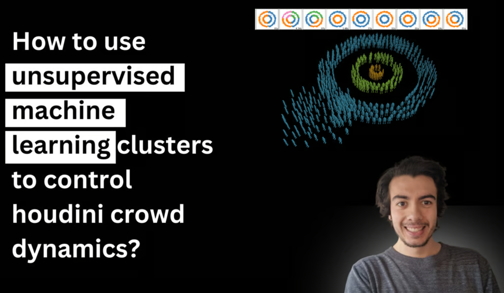
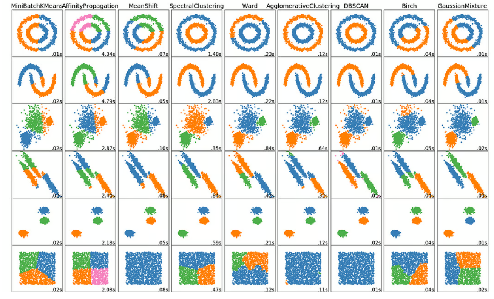
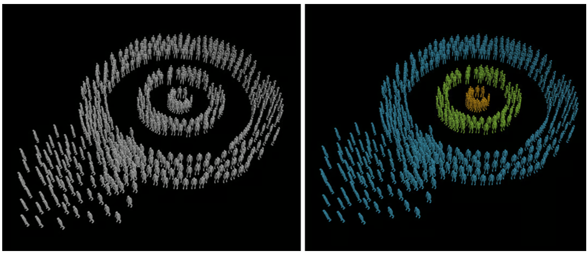

# How to use unsupervised machine learning clusters to control houdini crowd dynamics?

[I recently have been using clustering algorithms to group crowd agents inside houdini to later apply different behaviours at simulation time.](https://youtu.be/F-vGEH2due0?si=uxouzTNahvtauXK2) This is providing a faster and creative way to solve crowd agents segmentation, offering an innovative solution to this age-old challenge.

Each cluster can represent different groups of characters, each exhibiting unique behaviours appropriate to their role in the scene. For instance, one cluster may simulate an advancing army, while another handles retreating troops.

### What is Clustering?

Clustering algorithms are at the heart of many machine learning strategies, designed to group a set of objects in such a way that objects in the same group (a cluster) are more similar to each other than to those in other groups.

Unlike supervised learning where models are trained on labelled data, unsupervised learning algorithms like clustering help discover hidden patterns or data groupings without the need for human intervention.

There are multiple algorithms for clustering and as seen in the image below, each one groups data in different ways. For instance, k-means, has the goal of minimising the sum of distances between the points and their respective cluster centroid. While Gaussian Mixture Models, instead of assigning each data point to a single cluster, encompasses the data points by assigning a probability to each point that indicates its likelihood of belonging to a particular cluster.

### Usage of clustering for visual effects

Crowd Simulation in Epic Battle Scenes:

In movies with large battle scenes, clustering algorithms are used to manage vast numbers of crowd agents. Each cluster can represent different groups of characters, each exhibiting unique behaviours.

Weather Effects in Large-scale Environments:

Films that feature extensive environmental effects, such as tornadoes or hurricanes, use clustering to dynamically group elements of the scene. This method allows for the realistic simulation of weather patterns affecting different areas of the scene differently, such as varying wind speeds or debris paths, enhancing the overall realism of the scene.

Space and Underwater Scenes:

Clustering helps manage complex particle simulations to create captivating space nebulae or underwater effects. By clustering similar particle types, VFX artists can more efficiently render scenes with a high level of detail and dynamic behaviour, such as floating debris in space or schools of fish moving in unison.

Fire and Explosion Effects: In action movies, clustering is used to simulate explosions and fires. Each cluster can control various attributes of the fire or explosion, such as intensity, spread, and color, making the effects more varied and realistic.

Architectural Destruction: These algorithms allow for the realistic crumbling of buildings in different patterns based on the materials and structural integrity of different parts of the buildings, making the destruction appear more chaotic and natural.

### Watch my youtube video!

In my youtube video I am showcasing [DBSCAN (Density-Based Spatial Clustering) to group crowd agents inside houdini to later apply different behaviours at simulation time.](https://youtu.be/F-vGEH2due0?si=uxouzTNahvtauXK2)

The image above is a representation of how density-based spatial clustering is able to cluster each group of people in the houdini simulation.This algorithm views clusters as areas of high density separated by areas of low density.It groups together points that are closely packed together, marking as outliers the points that lie alone in low-density regions (which are usually considered to be noise). This method allows the algorithm to discover clusters of arbitrary shape,

To watch the youtube video just hit the link below:

[Check out the full YouTube video here (and be sure to subscribe to my channel).](https://youtu.be/F-vGEH2due0?si=uxouzTNahvtauXK2)

Enjoy this? [Share the post with others and follow me](https://oriolmanzano.com/newsletter)!