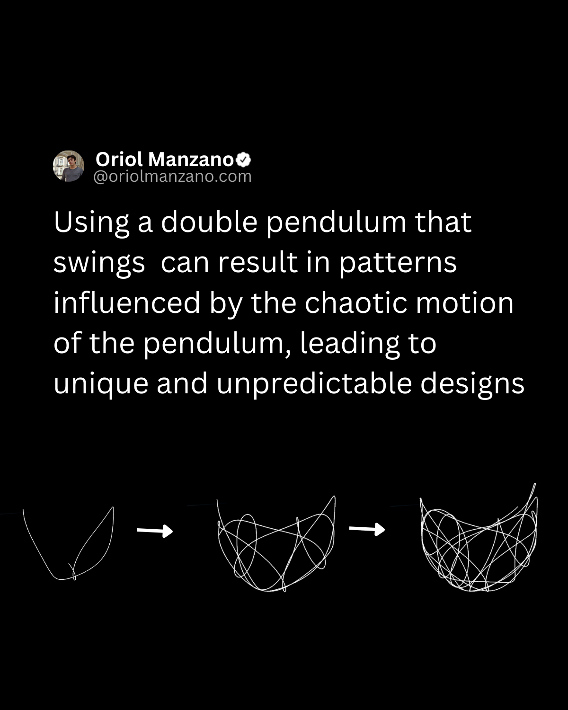

# Double Pendulum

Chaos physics, often associated with chaos theory, examines systems that exhibit sensitive dependence on initial conditions, leading to seemingly random and unpredictable behaviors that are, in fact, determined by deterministic laws. 

This area of physics can serve as a rich source of inspiration for creating art. 

Pendulum Motion is an example of how chaos physics can be incorporated into artistic endeavors.

Enjoy this? [Share the post with others and follow me](https://oriolmanzano.com/newsletter)!
