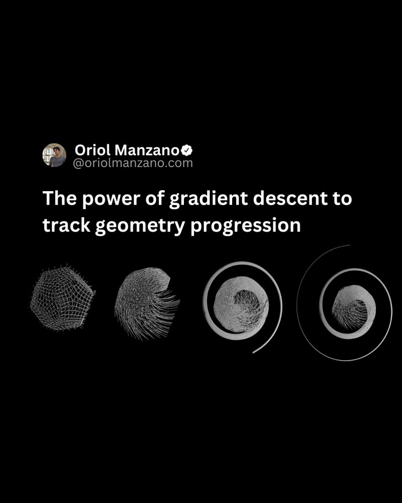

Gradient descent is an iterative optimization algorithm used to find the minimum of a function and it is not following a predefined path. However, we can design a problem where the "cost function" is creatively defined to make the point move in a spiral pattern as it "minimizes" this function.

This involves:
1-Defining a moving target whose path is a spiral.
2-Defining an objective function that represents the distance from the point to this target.
3-Using gradient descent to move the point towards the target, with the target moving every iteration to create a spiral path.

Enjoy this? [Share the post with others and follow me](https://oriolmanzano.com/newsletter)!