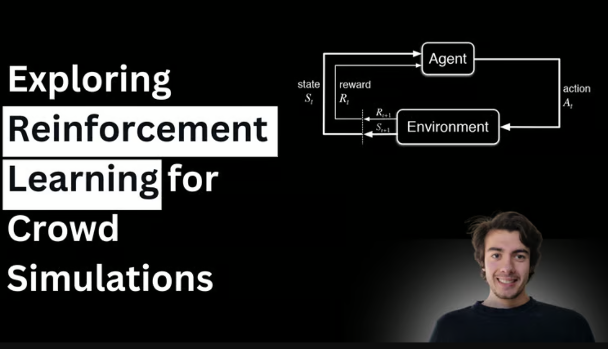

# Exploring Reinforcement Learning for Crowd Simulations

Achieving a visually diverse crowd where each individual appears unique in terms of appearance and behavior is challenging.

Each simulated agent (individual in the crowd) must behave in a way that is believable and appropriate for the context, which involves intricate programming and design to capture a wide range of  reactions and interactions.

While there are specialized tools and software designed for crowd simulation (e.g., Houdini), they have their limitations and learning curves. They provide systems to have conditional statements for crowds behaviors but lack the remarkable results in sequential decision-making that a reinforcement learning methods can provide.

The key challenge here is that the environment changes dynamically, where the current decision of an agent can largely affect the state of other agents as well as the agent in the future. 

Reinforcement Learning, a branch of AI, is able to train the model inside the dynamic environment by reviewing if the action taken for the agent is approaching him to a given reward function.The algorithms learn optimal actions through trial and error, using feedback from the environment to achieve specific goals.

### The reward function

The reward function can vary:

Navigate to a goal: Reward the agent for any decrease in distance to a goal location.                                                            

Group and formation keeping: In scenarios where agents are supposed to move in formation or groups, reward can be based on the agent's ability to stay in formation or proximity to the group center.

Adaptive Behavior: Rewards based on the changing environment or objectives, such as dynamically adjusting goals or responding to emergencies, can be modeled to train agents for adaptability.

### The benefits are clear:

Realism: Achieve unparalleled levels of realism in crowd simulations that surpass the fuzzy logic that 3D software provides , with each agent behaving in a way that mimics real-life individual decision-making. 

Efficiency: Drastically reduce the time and effort required to manually adjust individual agent behaviors in complex scenes. 

Adaptability: Easily adapt the simulation for various scenarios. For example, from serene to chaotic, by simply adjusting the reinforcement learning models' parameters.

### Dive Deeper 

For those intrigued by the technical intricacies of implementing reinforcement learning within Houdini. I've implemented a simple navigate to a goal solution that updates in the course of the DOP simulation the velocity of each agent. The code and houdini file can be found in [https://github.com/mrnsapple/HoudiniTips/tree/main/projects/RL_Crowds/src](https://github.com/mrnsapple/HoudiniTips/tree/main/projects/RL_Crowds/src)

Enjoy this? [Share the post with others and follow me](https://oriolmanzano.com/newsletter)!