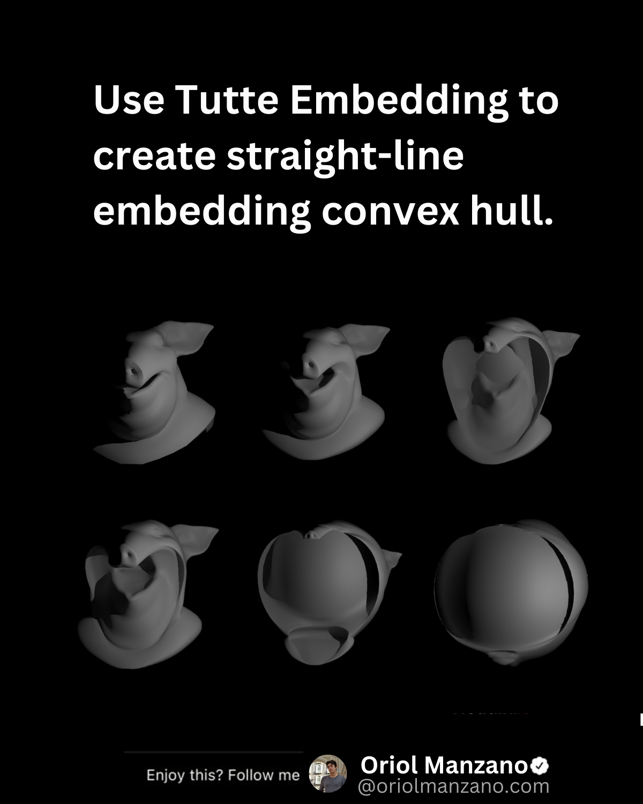

# Tutte Embedding

Tutte Embedding, a powerful technique in graph theory, enables us to visualize complex networks in a more intuitive and insightful manner. By mapping graphs onto geometric shapes while preserving their structural properties, Tutte Embedding provides a clear visual representation, facilitating better understanding and analysis.

If we treat the points of a 3d mesh as a graph, we can use tutte embedding to make each edge avoid interaction with other nearby edges. This translates the points to the external boundary of the mesh converting it into a crossing-free straight-line embedding convex hull.

It works only for small graphs and the resulting mesh is not always aesthetically pleasing.

Enjoy this? [Share the post with others and follow me](https://oriolmanzano.com/newsletter)!